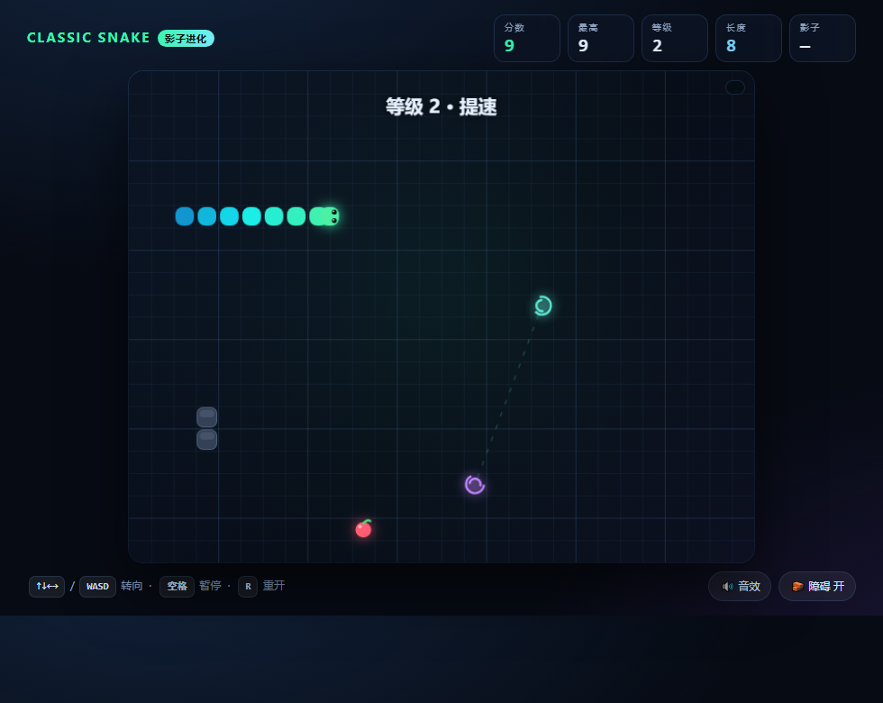

# 贪吃蛇 · 影子进化 (Classic Snake, Reinvented)

单文件网页游戏：**原生 JavaScript (ES6) + HTML5 Canvas + CSS**，零依赖、零构建，双击 `index.html` 就能玩。



## 玩法

经典的贪吃蛇规则：吃果子变长、撞墙或撞到自己就结束。在此之上加了 4 个新机制：

| 机制 | 说明 |
| --- | --- |
| **影子竞速** | 你的最高分那一局会被完整录下来，变成半透明影子蛇和你同场重跑。分数超过影子，HUD 会显示「已超越」。录像存在浏览器 localStorage，关掉页面也还在 |
| **虫洞** | 场上有一对旋转虫洞，穿进去从另一头钻出来；每 16~22 秒会换个位置 |
| **连击** | 2.6 秒内连续吃果，倍率 x1 → x5 递增；配合双倍道具可达 x10 |
| **道具** | 👻 幽灵（穿墙穿身 + 边界环绕 6s）· ⏳ 慢动作 6s · ✦ 双倍分 8s · 🧲 磁铁（把果子一步步吸过来）7s |

难度曲线：每吃 5 个果子升 1 级，速度加快，并按等级生成 2~3 格长的障碍；金苹果（概率出现，9 秒过期）值 3 分并长 2 节。

## 操作

- `↑ ↓ ← →` 或 `W A S D` 转向（带 2 步输入缓冲，转角不丢键）
- `空格` 暂停 / 继续，`R` 重开，`M` 静音
- 手机：在棋盘上滑动，或点底部方向键
- 右下角可开关 **音效** 和 **障碍**（想玩纯净版就关掉障碍）

## 实现要点

- 固定 28×22 网格 + `requestAnimationFrame` 累加器固定步长推进，渲染用蛇身插值做平滑移动
- 幽灵模式会环绕边界、穿过身体和障碍；自撞检测会放过"正在让位"的尾巴格
- 影子回放只存每步的蛇头坐标与长度，回放时倒推身体，几万步也只有几十 KB
- 画布按 devicePixelRatio 缩放，自适应窗口；无第三方库、无构建步骤

## 运行

```
直接双击 index.html
# 或者起个本地服务（可选）
python -m http.server 8000
```
